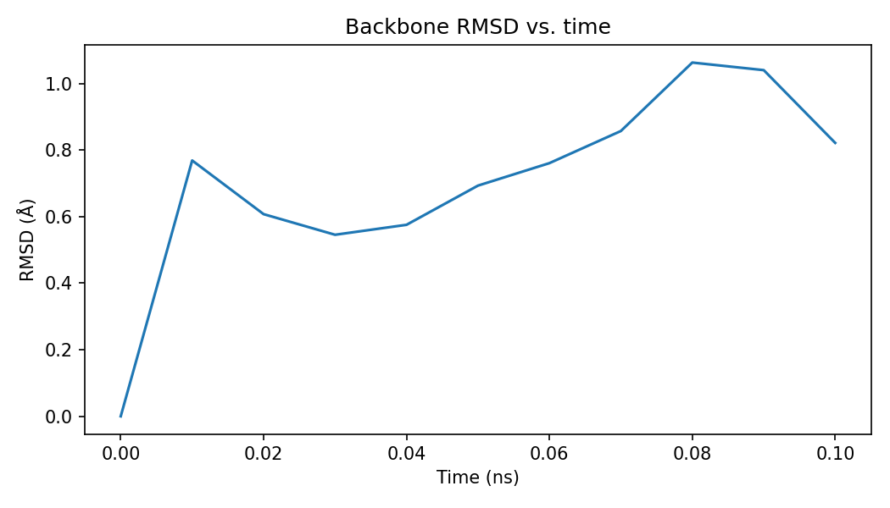
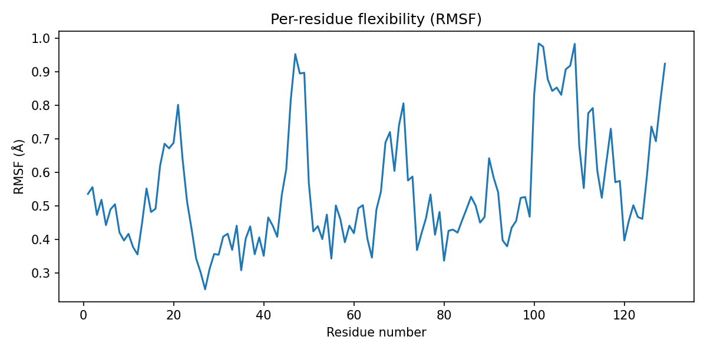
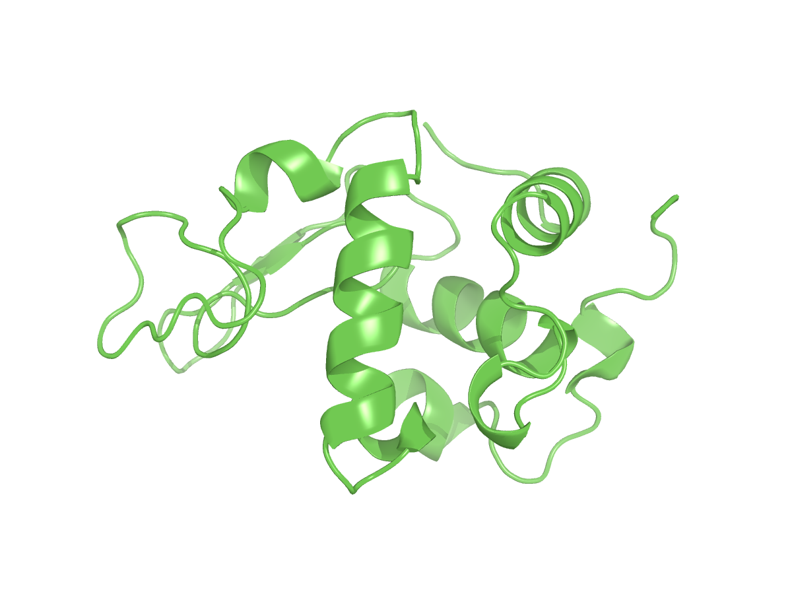

# MD Trajectory Analysis

Post-processing and analysis of a short molecular dynamics simulation:
RMSD/RMSF calculation in Python (MDAnalysis), structure rendering in PyMOL.

## About this repository

This is an independent portfolio project. The simulation system follows
the standard "Lysozyme in Water" GROMACS tutorial by Justin Lemkul
(http://www.mdtutorials.com/gmx/lysozyme/index.html), using PDB structure
1AKI. It is a learning/demonstration exercise, not connected to my
published research — the simulations behind my actual publications were
performed separately and are not reproduced here.

## What this demonstrates

- Running and managing a GROMACS MD simulation
- Loading and analyzing a trajectory in Python with MDAnalysis
- Computing RMSD (overall structural drift) and RMSF (per-residue flexibility)
- Rendering a structure programmatically with PyMOL

## Technical stack

| Component | Function |
|---|---|
| GROMACS | Running the MD simulation |
| MDAnalysis | Trajectory loading, RMSD/RMSF calculation |
| matplotlib | Plotting |
| PyMOL (open-source build) | Structure rendering |

## Usage

```bash
conda create -n md-portfolio python=3.11 -y
conda activate md-portfolio
conda install -c conda-forge gromacs pymol-open-source mdanalysis matplotlib pandas -y

python analyze_trajectory.py
pymol -cq render_structure.pml
```

## Example output





## File structure

```
md-trajectory-analysis/
├── analyze_trajectory.py     # RMSD/RMSF analysis script
├── render_structure.pml      # PyMOL rendering script
├── results/                  # Generated plots and renders
└── README.md
```